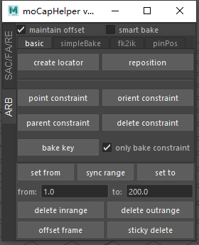

# MotionCapHelper
 maya simple plugin for animator

# main feature:主要功能
animation curve smooth:平滑动画曲线
frame align:在参考物体的帧时间k选择物体的帧，并删除其他帧。（对齐帧）
regular expression:根据正则表达式过滤物体名，并创建（多个）显示层
animation rebuild:删除范围内外帧，偏移选中物体帧，手动提取关键帧，快速烘焙动画到另一个物体，fk转换ik，钉住世界位置，快速烘焙父子约束效果。

都是非常简单的功能，其中平滑曲线的代码来自https://blog.csdn.net/lulongfei172006/article/details/51493273/

# support maya version:支持版本
maya 2018+

