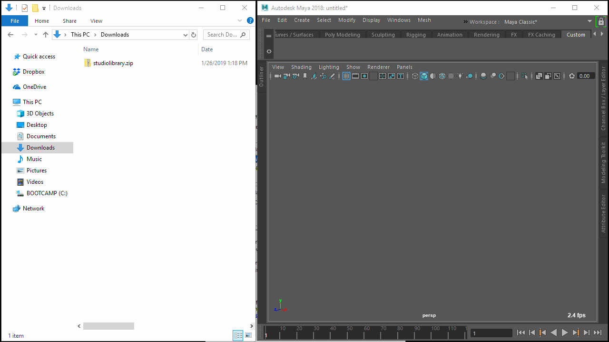



Studio Library 是一个基于 Python 的 Qt 工具，用于管理 Maya 中的姿势和动画。

## 特性 

* 保存姿势和动画
* 镜像姿势和动画
* 创建易于使用的选择集
* MMB 拖动以快速混合姿势
* LMB 拖放以组织项目
* 插入、合并和替换动画
* 支持 Windows、Linux 和 OSX
* 支持 Maya 2018+

## 教程

* [如何使用姿势](https://www.youtube.com/watch?v=lpaWrT7VXfM)
* [如何使用选择集](https://www.youtube.com/watch?v=xejWubal_j8)
* [如何使用镜像表](https://www.youtube.com/watch?v=kCv0XleJfjU&t=3s)

## 安装

1. 从 [github releases](https://github.com/krathjen/studiolibrary/releases) 或 [网站](http://www.studiolibrary.com/download) 下载并解压 *studiolibrary.zip* 文件。

2. 将 "studiolibrary/install.mel" 文件拖放到 Maya 视口中。

3. 点击工具栏上的 Studio Library 图标以运行。

提示：如果您想与其他用户共享 Studio Library，请将解压后的 "studiolibrary" 文件夹放在网络驱动器上。

## 文档

在 [这里](DOCS.md) 查找最新文档。

## 贡献

欢迎对 Studio Library 进行贡献！无论是报告错误、功能请求、讨论想法还是提交代码。

我们遵循以下指南...

* [提交信息风格](https://github.com/erlang/otp/wiki/Writing-good-commit-messages)

* [GitHub 分叉工作流程](https://gist.github.com/Chaser324/ce0505fbed06b947d962)

* [Python Qt 风格指南](http://bitesofcode.blogspot.co.uk/2011/10/pyqt-coding-style-guidelines.html)

## 许可证

Studio Library 在 GNU 较宽松公共许可证 v3.0 下免费用于生产。
有关更多信息，请点击 [这里](LICENSE.md)。

## 支持

欢迎提出意见、建议和错误报告。

请随时在 [github issues](https://github.com/krathjen/studiolibrary/issues/new) 
提交任何问题，附上错误信息和详细的步骤说明，
或者联系 [support@studiolibrary.com](support@studiolibrary.com)。
